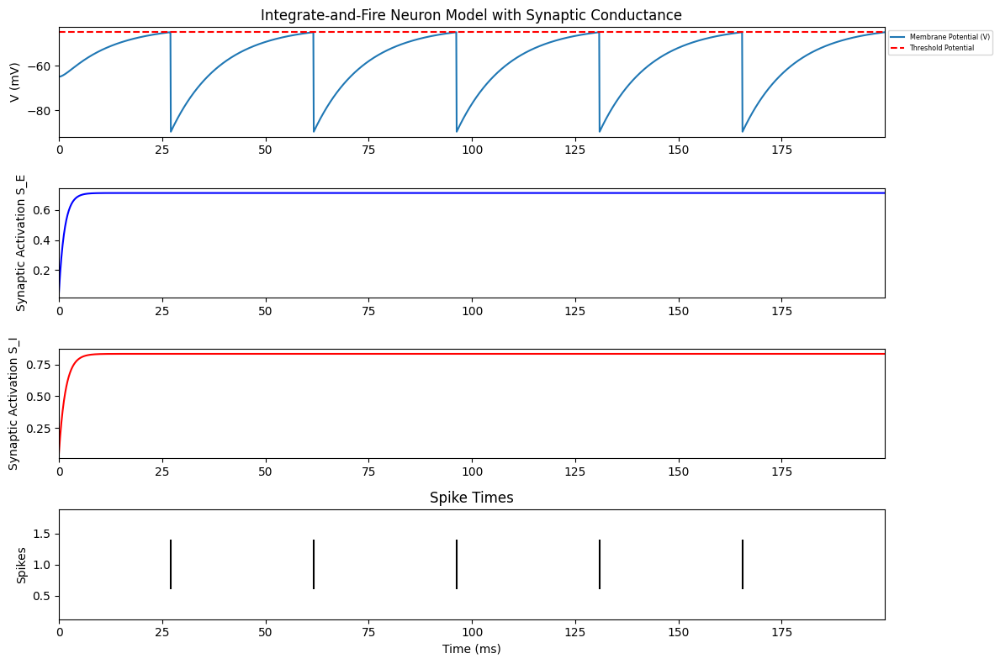
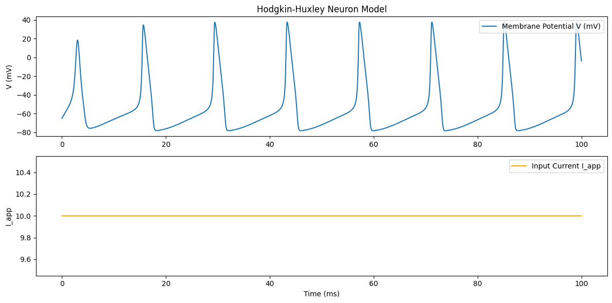
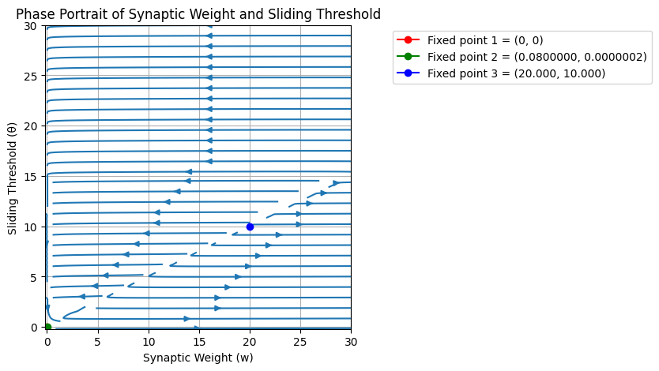

# Fundamental Computational Neuroscience Models

*by Younginn Park*

Sample simulations of selected fundamental **Computational Neuroscience** models, which form the theoretical foundation for understanding biological computation and provided the initial inspiration for artificial neural networks (ANNs).

## Contents
### 1. Integrate-and-Fire (IF) model

A simplified neuron model that integrates incoming signals and generates spikes once a threshold potential is reached.

$$
\begin{cases}
\tau \frac{dV}{dt} = -(V - V_r) - w_E S_E(t) V - w_I S_I(t)(V-V_I) \\
\frac{S_E}{dt}     = -\frac{S_E}{\tau_E} + (1-S_E)f_E \\
\frac{S_I}{dt}     = -\frac{S_I}{\tau_I} + (1-S_E)f_I
\end{cases}
$$

  <figure>
    
     
    <figcaption style="text-align:center;"><em>Figure 1. Example of IF model simulation output</em></figcaption>
  </figure>

### 2. Hodgkin-Huxley (HH) model

A biophysical model describing how action potentials in neurons arise from ionic currents across the cell membrane.

$$
\begin{cases}
C \frac{dV}{dt} = - g_K n^4(V - V_k) - g_{Na} m^3h(V - V_{Na}) - g_L(V - V_L) + I_{app} \\
\frac{dn}{dt} = \alpha_n (1 - n) - \beta_n n \\
\frac{dm}{dt} = \alpha_m (1 - m) - \beta_m m \\
\frac{dh}{dt} = \alpha_h (1 - h) - \beta_h h \\
\end{cases}
$$

$$
\begin{cases}
\alpha_n = \frac{0.1 (V + 55)}{1 - e^{-0.1 (V + 55)}} \\
\beta_n = 0.125 e ^{-0.0125 (V + 65)} \\
\alpha_m = \frac{0.1 (V + 40)}{1 - e^{-0.1 (V + 40)}} \\
\beta_m = 4 e ^{-0.05 (V + 65)} \\
\alpha_h =  0.07 e^{-0.05 (V + 65)} \\
\beta_h = \frac{1}{1 + e^{-0.1 (V + 35)}} \\
\end{cases}
$$

  <figure>
    
     
    <figcaption style="text-align:center;"><em>Figure 2. Example of HH model simulation output with a constant input current</em></figcaption>
  </figure>

### 3. Bienenstock-Cooper-Munro (BCM) model

A synaptic plasticity model explaining how neurons adjust connection strengths based on activity history to support learning and memory. The fixed points represent stable or unstable synaptic states that determine whether a synapse weakens, remains unchanged, or strengthens over time.

$$
\begin{cases}
\tau_w \frac{dw}{dt} = \lambda f r (r - \theta) - \epsilon w \\
\tau_\theta \frac{d\theta}{dt} = - \theta + \alpha r^2 \\
\tau_r \frac{dr}{dt} = - r + \beta w f
\end{cases}
$$

  <figure>
    
     
    <figcaption style="text-align:center;"><em>Figure 3. Example of BCM model simulation's phase portrait and its fixed points</em></figcaption>
  </figure>

 
 
 

_More details about the models and the parameters in each of the project folders_
